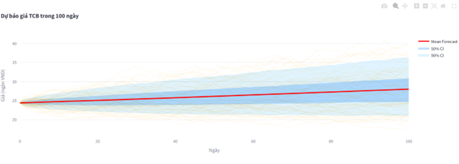
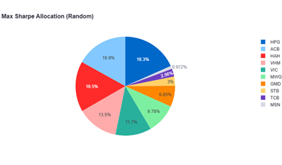
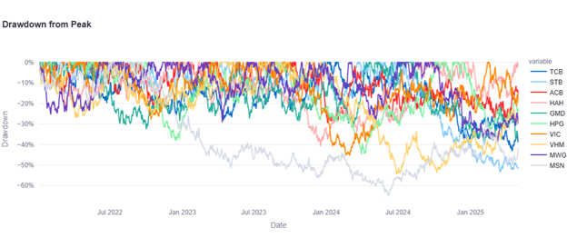

# 📊 Vietnam Stock Portfolio Optimizer
*A Business Intelligence project that turns Vietnam market data into investable, decision-ready insights.*

This is my **individual project** building an end-to-end **portfolio optimization & risk analytics** workflow in Python.  
It applies **Modern Portfolio Theory** (Efficient Frontier, Max Sharpe, Min Vol), **Monte Carlo simulation**, and **risk governance metrics** (VaR/CVaR, drawdown), then visualizes the outcomes so **executives and BI stakeholders** can make **clear, defensible decisions**.

---

## 🧭 Table of Contents
1. [Executive Summary](#-executive-summary)
2. [Data & Lineage](#-data--lineage)
3. [Analytics Pipeline (BI-ready)](#-analytics-pipeline-bi-ready)
4. [Results & Business Impact](#-results--business-impact)
5. [KPI Definitions (for stakeholders)](#-kpi-definitions-for-stakeholders)
6. [How to Reproduce](#-how-to-reproduce)
7. [Assumptions, Limitations & Next Steps](#-assumptions-limitations--next-steps)
8. [Repository Structure](#-repository-structure)
9. [Author](#-author)

---

## 🎯 Executive Summary
**Business problem:** Construct a portfolio that **maximizes risk-adjusted return** while staying **explainable** for non-technical decision-makers.  
**What this repo delivers:** a BI-friendly flow — **clean inputs → robust analytics → decision-ready visuals** — with transparent **risk/return trade-offs**.

**Headlines**
- **Optimized portfolio:** ~**28.04% annualized return** with ~**11.12% annualized volatility**  
- **Benchmark context:** Volatility of **VNINDEX ~31.84%**, **VN30 ~31.40%**  
- **Full risk stack:** **VaR/CVaR** (1-day, 95%), **drawdown**, **correlation** — enabling **policy-grade risk limits** and “what-if” reporting

> All numbers are **reproducible** from the notebook. See **How to Reproduce**.

---

## 📊 Data & Lineage
- **Universe:** 10 liquid Vietnam stocks across key sectors (HOSE/HNX/UPCOM)  
- **Benchmarks:** VNINDEX, VN30  
- **Frequency:** Daily close (multi-year)  
- **Source:** data fetched/processed in notebook with `vnstock` (no proprietary data stored in repo)

**Market context (raw trends)**
  
*Candlestick + MA20/MA50 + volume — a quick sanity check on price dynamics.*

---

## ⚙️ Analytics Pipeline (BI-ready)
1) **Data Prep & Sanity Checks**  
   Align trading calendars, compute log-returns, estimate covariance, validate outliers.

2) **Monte Carlo Simulation (10k+ portfolios)**  
   Random long-only weights (sum=1); compute **expected return, volatility, Sharpe** for each candidate.

3) **Efficient Frontier & Optimal Points**  
   Trace the **frontier**, extract **Max Sharpe** and **Min Volatility** portfolios; export **weights** for explainability.

4) **Risk Intelligence**  
   **VaR / CVaR** (historical & parametric), **return distribution**, **rolling volatility**, and **drawdown** to inform policy limits.

5) **Benchmarking & Attribution**  
   Compare cumulative performance against **VNINDEX** / **VN30**; explain improvements in **risk-adjusted** terms.

---

## 🚀 Results & Business Impact

**Efficient Frontier**


**Monte Carlo cloud (return–vol)**


**Optimal weights (example: Max Sharpe)**


**Portfolio vs Benchmarks (cumulative)**


**Risk–Return: single stocks vs portfolios**


**Risk governance (VaR/CVaR & distribution)**


**Stability over time**


**Correlation & drawdown**



### 📌 KPI Snapshot (reproducible)
- **Optimized Portfolio:** ~**28.04%** annual return, ~**11.12%** annual volatility, high Sharpe  
- **VNINDEX:** ~**31.84%** annual volatility  
- **VN30:** ~**31.40%** annual volatility  
- **VaR/CVaR (1-day, 95%)** in a ~**1.0%–1.3%** loss band

> **BI takeaways**  
> • Frontier + weights make choices **defensible** in committees and governance reviews.  
> • VaR/CVaR & drawdown enable **policy-grade risk limits** and realistic scenarios.  
> • Pipeline is **reusable** for CIO dashboards, product P&L, quant PM workflows, or quarterly board packs.

---

## 📐 KPI Definitions (for stakeholders)
- **Annualized Return:** mean daily return × trading days/year  
- **Annualized Volatility:** std(daily returns) × √(trading days/year)  
- **Sharpe Ratio:** (annualized return − risk-free) / annualized volatility *(risk-free≈0 for simplicity)*  
- **VaR (Value at Risk):** loss threshold not exceeded with **95%** confidence over 1 day  
- **CVaR (Expected Shortfall):** expected loss **conditional** on exceeding VaR  
- **Max Drawdown:** largest peak-to-trough decline (measures worst path risk)

These definitions make the **BI dashboard explainable** to non-quant stakeholders.

---

## ▶️ How to Reproduce
1. Open `Notebooks/Portfolio_Optimizer.ipynb` in **Google Colab** or **Jupyter**  
2. Run the **setup cells** to install/import deps (`pandas`, `numpy`, `scipy`, `plotly`, `kaleido`, `vnstock`)  
3. Execute the notebook **top-to-bottom** — figures are saved into `/Results`  
4. Change scenario **knobs** to explore:  
   - **Universe:** swap tickers / sector caps  
   - **Constraints:** long-only, max weight per stock, etc.  
   - **Risk appetite:** focus on **Max Sharpe** vs **Min Vol**  
   - **Rebalancing rules:** monthly/quarterly backtests (extendable)

> Tip: Keep outputs cleared before committing to Git for a lightweight repo.

---

## ⚖️ Assumptions, Limitations & Next Steps
**Assumptions**
- Long-only, no shorting; weights sum to 1  
- No fees/slippage (can be added)  
- Risk-free rate ~0 for Sharpe (can parameterize)

**Limitations**
- Daily frequency; intraday dynamics not modeled  
- No transaction costs / market impact yet  
- Monte Carlo explores many portfolios but not **all** constraints (e.g., sector/ESG caps) by default

**Next Steps**
- Add **transaction costs**, **rebalancing**, **turnover constraints**  
- Parameterize **risk-free rate** and **stress scenarios**  
- Export **weight reports** & **data lineage** to BI tools (Power BI/Tableau)  
- Optional: **Streamlit app** for interactive what-if analysis

---

## 📁 Repository Structure
```text
.
├── README.md
├── Notebooks/
│   └── Portfolio_Optimizer.ipynb
└── Results/
    ├── price_ma_candlestick.png
    ├── daily_return_distribution.png
    ├── efficient_frontier.png
    ├── monte_carlo_simulation.png
    ├── max_sharpe_allocation.png
    ├── performance_vs_benchmarks.png
    ├── risk_return_profile.png
    ├── rolling_volatility.png
    ├── portfolio_var_cvar.png
    ├── correlation_heatmap.png
    └── drawdown_chart.png


---

## 👤 Author
**Nguyen Thi Thanh Truc** — Business Analyst / BI Candidate  
Turning complex market data into **clear stories, KPIs, and defensible decisions**.  
*I’m passionate about building analytics that stakeholders can trust — reproducible, explainable, and useful.*
