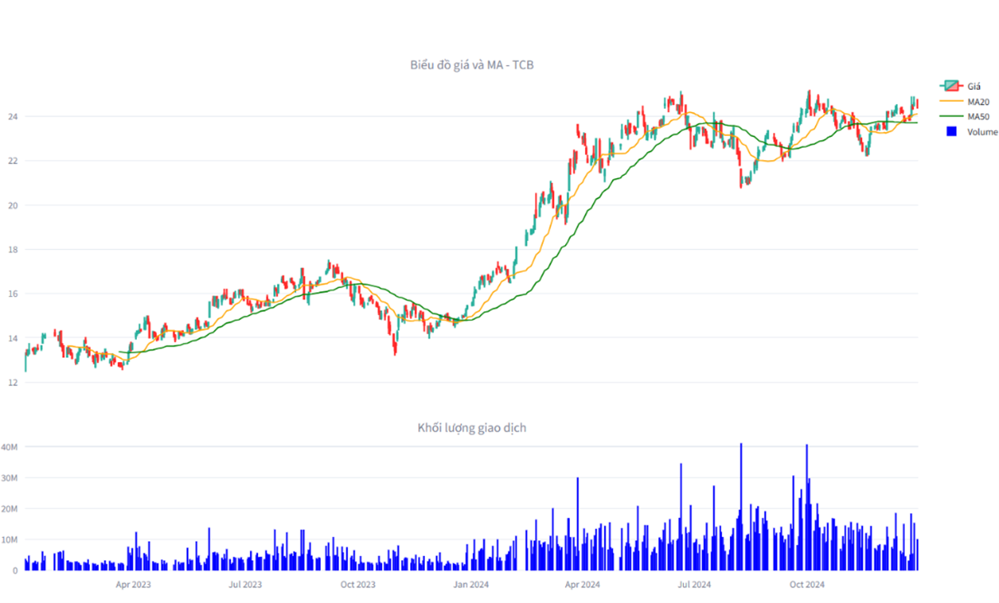
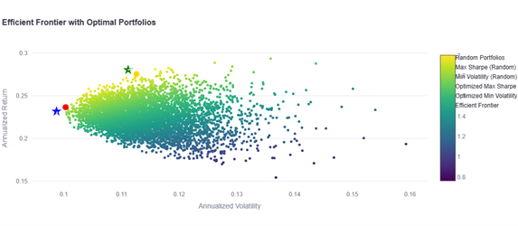
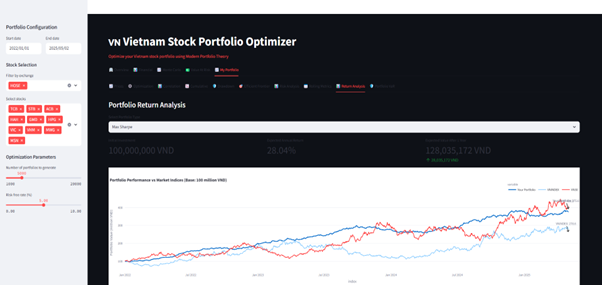
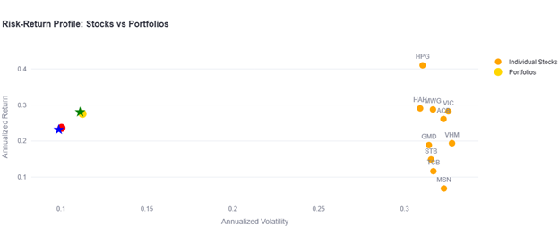
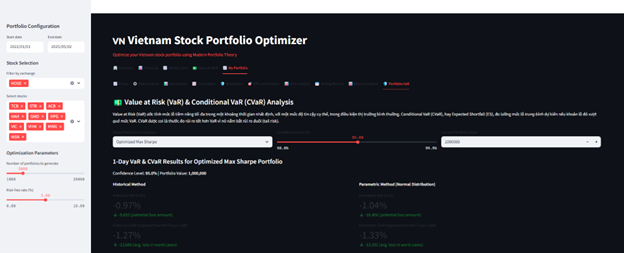
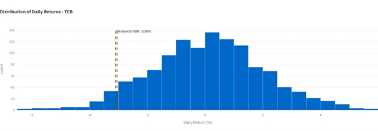
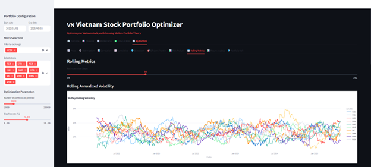

# 📊 Vietnam Stock Portfolio Optimizer
*A Business Intelligence project that turns Vietnam market data into investable, decision-ready insights.*

This is my project that builds an end-to-end **portfolio optimization & risk analytics** workflow using Python.  
It applies **Modern Portfolio Theory** (Efficient Frontier, Max Sharpe, Min Vol), **Monte Carlo simulation**, and **risk metrics** (VaR/CVaR, drawdown), then visualizes the results so **executives and BI stakeholders** can make clear, defensible decisions.

---

## 🎯 Executive Summary
**Business problem:** how to construct a portfolio that **maximizes risk-adjusted returns** and remains **explainable** to non-technical decision makers.  
**What this repo delivers:** a BI-friendly flow — **clean inputs → robust analytics → decision-ready visuals** — with transparent trade-offs between risk and return.

**Headlines**
- Optimal portfolio achieved **~28.04% annualized return** with **~11.12% annualized volatility**  
- Outperformed **VNINDEX** and approached **VN30** while maintaining **much lower volatility**  
- Full stack of **risk governance**: VaR/CVaR, drawdown, correlation structure

*(All numbers are reproducible from the notebook; see “How to Reproduce”.)*

---

## 📊 Data
- **Universe:** 10 liquid Vietnam stocks across key sectors (HOSE/HNX/UPCOM)
- **Benchmarks:** VNINDEX, VN30
- **Frequency:** Daily prices (multi-year)
- **Source:** [`vnstock` API] processed in notebook (no proprietary data stored)

**Example market context (raw trends)**

*Candlestick + MA20/MA50 + volume*

---

## ⚙️ Methodology (BI-ready)
1) **Data prep & sanity checks** — align trading calendars, log-returns, covariance
2) **Monte Carlo simulation (10k+ portfolios)** — random long-only weights, compute **expected return / volatility / Sharpe**
3) **Efficient Frontier & optimal portfolios** — extract **Max Sharpe** and **Min Vol**, visualize trade-offs and weights
4) **Risk Intelligence** — **VaR/CVaR** (historical & parametric), **drawdown** analysis, distribution of daily returns
5) **Benchmarking & attribution** — compare cumulative performance with **VNINDEX/VN30**, highlight risk-adjusted outperformance

---

## 🚀 Results & Business Impact
**Efficient frontier**

**Monte Carlo (return–vol cloud)**

**Optimal weights (example: Max Sharpe)**

**Portfolio vs benchmarks (cumulative)**

**Risk–Return: stocks vs portfolios**

**Risk governance (VaR/CVaR & distribution)**

**Stability over time**

**Correlation & drawdown**

### KPI Snapshot (reproducible)
- **Portfolio (optimized):** ~**28.04%** annual return, **~11.12%** annual volatility, high Sharpe  
- **VNINDEX:** ~31.84% annual volatility  
- **VN30:** ~31.40% annual volatility  
- **VaR/CVaR (1-day, 95%)** within **~1.0%–1.3%** loss band

> **BI takeaways:**  
> • Frontier + weights make portfolio choices **defensible** in committees.  
> • VaR/CVaR & drawdown enable **policy-grade risk limits** and “what-if” reporting.  
> • The pipeline is **reusable** for CIO dashboards, product P&L, or PM workflows.

---

## ▶️ How to Reproduce
1. Open `Notebooks/Portfolio_Optimizer.ipynb` in **Colab/Jupyter**
2. Install deps (first cells handle `pandas`, `numpy`, `scipy`, `plotly`, `kaleido`, `vnstock`)
3. Run all cells — figures will be saved to `/Results`
4. Change the stock universe or constraints to explore scenarios (long-only, sector caps, etc.)

---

## 🛠️ Tech Stack
- **Python**: pandas, numpy, scipy, plotly/kaleido
- **Finance**: Modern Portfolio Theory, Efficient Frontier
- **Risk**: VaR, CVaR, drawdown
- **BI Mindset**: From raw data → KPIs → executive-ready visuals

---

## 👤 Author
**Nguyen Thi Thanh Truc** — Business Analyst / BI Candidate  
Turning complex market data into **clear stories, KPIs, and defensible decisions**.

